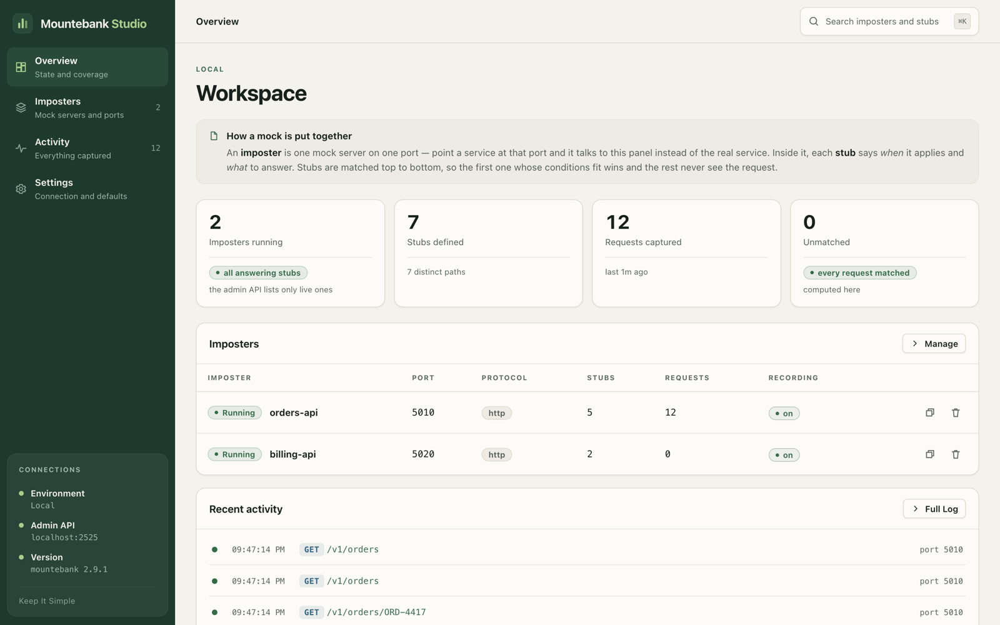
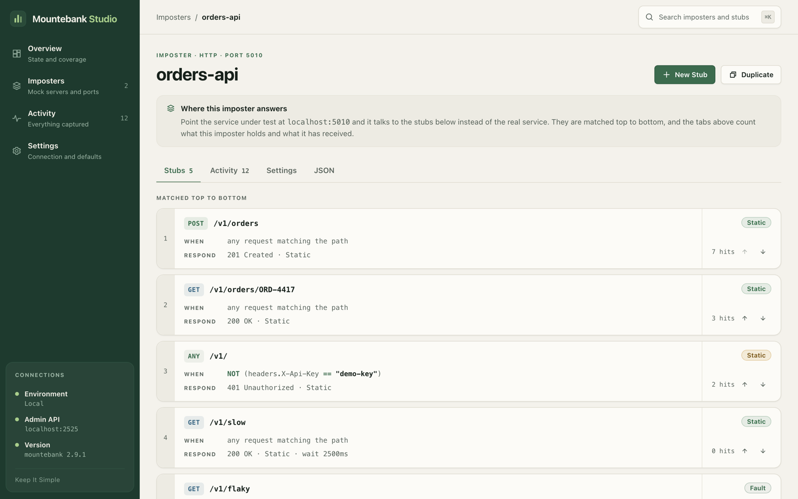
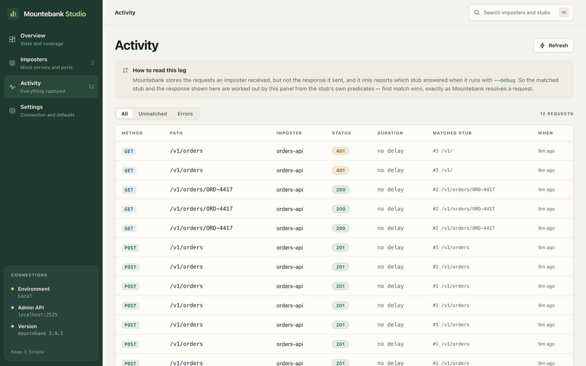

# Mountebank Studio

A visual control surface for [Mountebank](https://www.mbtest.dev/). It talks to the
admin API of any instance you point it at and gives you screens for the things you
would otherwise hand-write as JSON: imposters, stubs, predicates, responses, proxy
responses, behaviors, and the traffic each imposter has captured.



<details>
<summary>Two more screens</summary>

**One imposter and its stubs**, matched top to bottom, with the hit counts computed
from the captured traffic. The third stub shows a negated header condition; the fourth
carries a delay; the fifth breaks the connection instead of answering.



**The traffic**, with the stub that answered each request. Mountebank reports the
matched stub only with `--debug`, so the panel evaluates the predicates itself and says
so rather than implying the instance told it.



</details>

It is a shell, not a product for one team. It knows nothing about the service you
are mocking. You add your own instances, and they live in your browser.

What it covers of Mountebank — feature by feature, what it carries without drawing,
and how that was verified against the real package — is in
[COVERAGE.md](COVERAGE.md).

> **Unofficial.** Mountebank Studio is an independent project. It is not affiliated
> with, endorsed by, or sponsored by the [mountebank](https://www.mbtest.dev) project.
> Mountebank itself is MIT-licensed and is not redistributed here: the panel talks to
> an instance you run.

```bash
yarn install
yarn dev          # http://localhost:5273
```

The panel starts with an empty list and opens on a welcome screen: add your
instances there, one at a time, and press **Start** to enter the one you want to
work in. Everything is editable later under **Settings**. That screen also explains
Mountebank's model and carries a one-line command for standing an instance up if you
have none:

```bash
npx mountebank@2.9.1 --origin "http://localhost:5273"
```

---

## How the panel reaches an instance

The build is a static page, so there is no server between you and a Mountebank
admin API unless you put one there. That leaves two models, and an environment
picks one just by how its target is written.

### 1 · Directly — for an instance you start yourself

Target is the instance's own URL:

```
https://mb.example.com        or        http://localhost:2525
```

The browser calls that host from this page, which is cross-origin, so **that
instance has to allow this origin**:

```bash
mb start --origin "http://localhost:5273"
```

`--origin` is a pipe-separated allowlist and Mountebank echoes back whichever
origin matched, so the API opens to the pages you name rather than to the web:

```bash
mb start --origin "http://localhost:5273|https://mountebank-studio.example.com"
```

Cheap and zero-infrastructure, and correct for a Mountebank on your own machine.
It has one real limit: it only works on instances you can restart.

### 2 · Through this page's own host — for an instance somebody else deployed

Nothing to choose: **the panel takes this route by itself** whenever the host that
serves it says it forwards to that instance. Keep the instance's own URL in the
environment; routing is a fact about the deployment, not something a user should
have to know. (A path can still be entered by hand — `/mb/stage` — for a
deployment that forwards without publishing a map.)

Nothing is cross-origin, so CORS never enters the picture and the instance needs
**no flag, no restart and no change of any kind** — which matters when a DevOps
team owns it and "please add a browser flag to the mock server" is not a
sustainable request.

Two things are needed on the host, and both live in one file. First the forwarding
itself — in production one `location` block, see [`deploy/nginx.conf`](deploy/nginx.conf):

```nginx
location /mb/stage/ {
    proxy_pass https://mountebank.stg.example.com/;
    proxy_set_header Host mountebank.stg.example.com;
    proxy_http_version 1.1;
    proxy_buffering off;
}
```

Then the map, so the panel knows which path leads to which instance — one static
location in production, and automatic in development:

```nginx
location = /mb/targets.json {
    default_type application/json;
    add_header Cache-Control "no-store";
    return 200 '{"stage":"https://mountebank.stg.example.com"}';
}
```

```bash
# .env.local — comma-separated name=target pairs; the dev server publishes the map
MB_PROXY=stage=https://mb.stg.example.com,dev=https://mb.dev.example.com
```

The panel reads that map once, before its first request, and matches an environment
to a path **by upstream URL**. Matching by name would be a guess: an environment's
id is minted once from its label and outlives it, so `/mb/stage` can be live while
the environment called "stage" now points somewhere else — and following that guess
would silently show one instance's mocks as another's. No map means no forwarding
and every target is called directly.

`MB_PROXY` has no `VITE_` prefix on purpose: it configures the dev server and is
never readable from client code.

The two models mix freely — one environment each way is normal.

> **A forwarded path is an open door.** Whoever can reach it can rewrite those
> mocks, with none of the instance's own network restrictions in the way. Put the
> panel and its `/mb/*` paths behind the same authentication as your other
> internal tools.

### Either way, CORS is not access control

It is a rule browsers apply to scripts. Anything that can reach an instance over
the network — curl, another service, a script outside a browser — can call its
admin API whether or not your origin is on any list. If that matters, use
`mb start --apikey <secret>` and firewall the admin port.

### When a read fails, the panel does not guess

A refused origin and a dead host reach a script as the same opaque error, so the
panel repeats the request as `no-cors` — the browser performs that one regardless,
and it resolves only if something actually answered (`src/lib/mb/reach.ts`). One
extra request, one verdict, shared by every screen and re-earned every 20 seconds:

- _"Mountebank is up — but it will not answer this page"_ → it answered, and this
  host does not forward to it, so add `--origin` or add a forwarding rule.
- _"Nothing is up at that address"_ → wrong URL, or the instance is down.
- For a `/path` target the CORS answer is never offered, because it cannot apply:
  the fault is the forwarding rule or the instance behind it.

---

## Adding an environment

An environment is a record you create — on the welcome screen, or in **Settings**
once you are inside. It is runtime data, kept in
this browser under `mountebank-studio-environments` — never compiled in, never sent
anywhere. It holds:

| Field     | What it is                                                                                                                                                                 |
| --------- | -------------------------------------------------------------------------------------------------------------------------------------------------------------------------- |
| Name      | What the environment is called throughout the UI.                                                                                                                          |
| Admin API | Either an absolute `http(s)` URL of the instance's admin port (`2525` by default, not an imposter's port), or a path on this origin (`/mb/stage`) that is forwarded to it. |
| Note      | An optional caution shown next to the environment.                                                                                                                         |

That is the whole record. It carried two more fields once — a colour, and a
read-only switch — and both are gone: the colour only tinted a dot, and the switch
was a seatbelt the same person could unbuckle one screen away. Destructive actions
confirm themselves instead, which is where the protection belongs.

The id derived from the name is the first segment of every route
(`/<id>/imposters/4545`), so a link lands whoever opens it in the right place.

### Pre-provisioning with VITE_ENVIRONMENTS

To ship the panel already pointed at your instances, set `VITE_ENVIRONMENTS` to a
JSON array. It seeds the list **once**, on a fresh install; after that the user's
own edits win and the variable is never re-applied. Malformed entries are skipped
rather than crashing the app, so a typo cannot lock anyone out.

```bash
# .env.local — one line
VITE_ENVIRONMENTS=[{"id":"local","label":"Local","target":"http://localhost:2525"},{"id":"shared","label":"Shared sandbox","target":"https://mb.example.com","note":"Other people depend on these mocks."}]
```

`label` and `target` are required; `id` and `note` are optional. See `.env.example` for the annotated version.

---

## Layout

```
src/
├── lib/
│   ├── environments.ts      what an environment is: shape, slug, validation, seeding
│   ├── mb/
│   │   ├── types.ts         Mb* = mountebank's wire format · the rest = the editable model
│   │   ├── model.ts         the lossless bridge between the two
│   │   ├── simpleForm.ts    the plain-language predicate form, and what it cannot express
│   │   ├── match.ts         which stub answered a recorded request
│   │   ├── client.ts        the admin API, called straight from the browser
│   │   └── __fixtures__/    synthetic replayable payloads the round-trip tests assert against
│   ├── queries.ts           TanStack Query hooks, keyed per environment
│   ├── summaries.ts         the WHEN / RESPOND stub summaries
│   └── format.ts            time, plurals, status names
├── store/
│   ├── useEnvironments.ts   the environment list, persisted in this browser
│   └── useStudio.ts         current environment, detail level, palette, toasts
├── styles/                  design tokens; every size and colour comes from here
├── ui/                      the primitive library
├── components/              shell: sidebar, topbar, environment switcher, command palette
└── views/                   one module per screen
```

### Two conventions worth knowing before you touch anything

**Every size and colour comes from a token.** `src/styles/tokens.css` holds the
type scale (`--fs-micro` → `--fs-h1`) and the whole palette. Components use
`var(--fs-sm)`, never `12.5px`, and never a raw hex. It is the only way a panel
this dense stays visually consistent as it grows.

**Icon sizes are set in CSS, per context** — not at the call site, so they cannot
drift: nav 18px, buttons 16px, small buttons 14px, table row actions 17px.

---

## The model, and two things it protects you from

`model.ts` converts between Mountebank's JSON and the editable model in both
directions, and `model.test.ts` asserts round-trip identity across every construct
the editor claims to support. Two silent data-loss bugs are very easy to write
here, and both were caught that way.

**1. A predicate holds several fields, not one.** The idiomatic Mountebank
predicate is a bag of fields compared together:

```json
{ "equals": { "method": "POST", "path": "/v1/orders" } }
```

An editor that models one field per predicate drops `path` on save, and the stub
then matches every path. So a predicate carries a **list of conditions**. Splitting
them into separate predicates would also be wrong: inside an `or` group it silently
turns an AND into an OR.

**2. Values are compared by JSON type.** `{"equals":{"body":"00123456789"}}` and
`{"equals":{"body":123456789}}` are different predicates. Inferring the type from
the text would retype a digits-only reference into a number on the first save, and
the stub would stop matching forever. Every condition therefore carries its JSON
type explicitly, shown in the editor as a `str` / `num` / `bool` / `json` chip.
`guessType()` only ever _suggests_.

Writes are also minimal: a field you never set is not sent, so opening and saving a
stub does not rewrite keys that were never there.

## Matched stub

Mountebank reports which stub answered a request only when the instance runs with
`--debug`. Unless yours does, the panel evaluates the predicates itself
(`match.ts`, mirroring Mountebank's semantics — first match wins, case-insensitive
unless `caseSensitive`, type-exact comparison) and labels the result as computed. A
stub containing a predicate the editor cannot model is marked as unconfirmed rather
than silently treated as a non-match.

For the same reason the panel never claims to show a response Mountebank sent: the
request log stores requests only. Status and delay in the activity table are read
from the matched stub, and say so.

---

## Scripts

```bash
yarn dev            # dev server on :5273
yarn build          # typecheck + production bundle into dist/
yarn preview        # serve the build on :5273
yarn check:types    # tsc --noEmit
yarn tests          # vitest
yarn test:watch     # vitest, watching
yarn lint           # oxlint
yarn format         # prettier --write
```

## Deploying

```bash
yarn build
# copy dist/ to your web root, then use deploy/nginx.conf
```

[`deploy/nginx.conf`](deploy/nginx.conf) does two things: serves the build
(client-side routing via `try_files`, immutable caching for `/assets`) and carries a
commented `location /mb/<name>/` block per environment. Uncomment one per instance
you want to reach and the panel needs nothing from the Mountebank side — see
[How the panel reaches an instance](#how-the-panel-reaches-an-instance). Protect
both the panel and its `/mb/*` paths with your usual authentication: together they
let anyone rewrite those mocks.

---

## Licence

Apache License 2.0 — see [LICENSE](LICENSE) and [NOTICE](NOTICE).

That choice is deliberate. A permissive licence keeps the panel usable inside
companies whose legal teams refuse copyleft, which is exactly where mock servers are
needed most, and the patent grant is worth having for a corporate reader. Contributions
come in under the same terms (Apache-2.0, section 5); see
[CONTRIBUTING.md](CONTRIBUTING.md).

Security reports go through the private channel in [SECURITY.md](SECURITY.md), not a
public issue — these mocks decide what a system under test believes.
